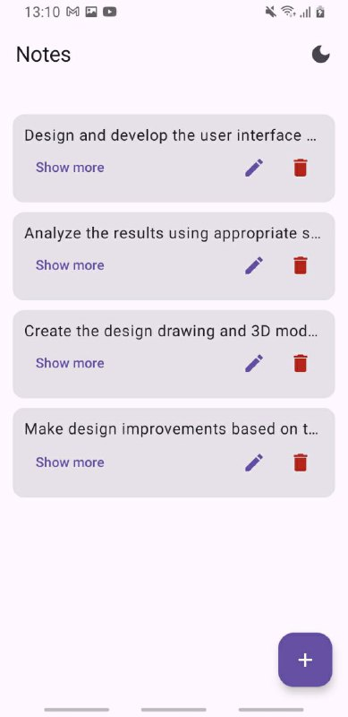
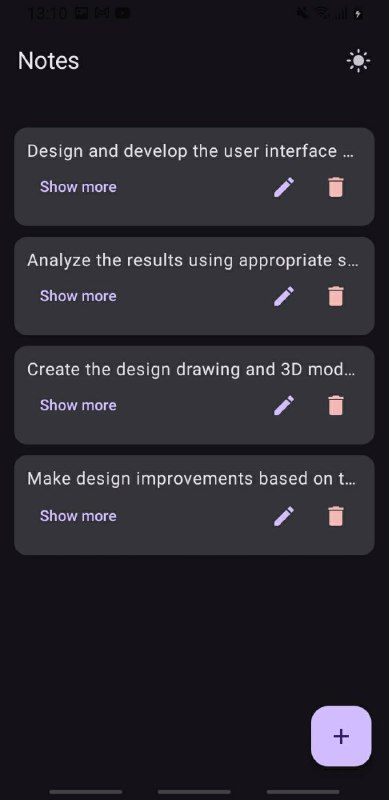

# NotesApp

A modern, Material 3 powered notes application built with Jetpack Compose. Quickly capture your thoughts, edit them in place, and keep everything organized with a clean and responsive UI.

## ✨ Features

- 📓 Create, edit, and delete notes with a simple workflow.
- 🌓 One-tap light & dark theme toggle with dynamic Material color palettes (Android 12+).
- 💾 Local persistence using Room for reliable offline storage.
- 🧭 Empty state guidance so new users never feel lost.
- ♿ Thoughtful typography and spacing for readability.

## 🛠️ Tech Stack

| Layer | Technology |
|-------|------------|
| UI | Jetpack Compose, Material 3 |
| State | ViewModel, Jetpack Lifecycle |
| Data | Room (DAO, Entities, Database) |
| Language | Kotlin |

## 🚀 Getting Started

1. **Clone the repository**
   ```bash
   git clone https://github.com/<username>/NotesApp.git
   ```
2. **Open in Android Studio** (Ladybug or newer recommended).
3. **Sync Gradle** to fetch dependencies.
4. **Run on device or emulator** (Android 6.0+).

> 💡 Tip: Enable *Tools ▸ Device Manager* in Android Studio to quickly create an emulator.

## 🎨 Theming

| Light Theme | Dark Theme |
|-------------|------------|
| Bright, high-contrast surfaces and accents ideal for daytime use. | Rich, subdued tones for low-light environments. |

<p align="center">
  
  
</p>

- Tap the theme icon in the top app bar to toggle between modes.
- On Android 12+, Material You dynamic colors blend with the system palette automatically.

## 📸 Screenshots

_Add screenshots or screen recordings here to showcase the UI._

## 📂 Project Structure (excerpt)

```
app/
├── src/main/java/com/example/notesapp
│   ├── MainActivity.kt           # Entry point wiring theme + navigation
│   ├── screens/MainScreen.kt     # Compose UI screens, dialogs, lists
│   ├── viewModel/ScreenViewModel.kt # UI state + Room interactions
│   └── ui/theme/                 # Light/Dark color schemes & typography
└── src/main/res/                 # Resources (strings, themes, icons)
```

## 🧭 Roadmap Ideas

- [ ] Note search & filtering
- [ ] Rich text formatting
- [ ] Cloud sync across devices
- [ ] App widget for at-a-glance notes

## 🤝 Contributing

Pull requests are welcome! For major changes, open an issue first to discuss what you would like to change.

1. Fork the repo
2. Create a feature branch (`git checkout -b feature/your-feature`)
3. Commit changes (`git commit -m 'Add something cool'`)
4. Push (`git push origin feature/your-feature`)
5. Open a Pull Request

## 📄 License

This project is distributed under the MIT License. See `LICENSE` for more information.
